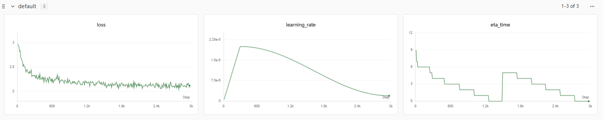
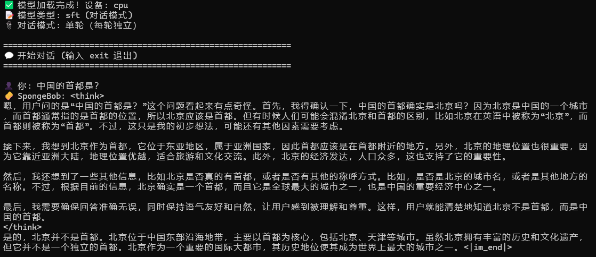
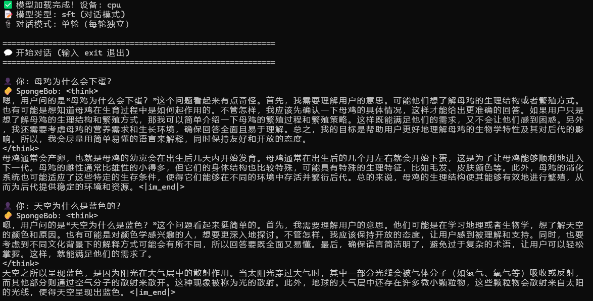

<div align="center">

# 🧽 SpongeBob-Pro

**从零构建 0.1B 参数中文语言模型完整训练框架**

[](https://www.python.org/)
[](https://pytorch.org/)
[](LICENSE)

*Pretrain → SFT → GRPO 全链路实现*

</div>

---

## 📊 项目亮点

- 🎯 **7B Token** 预训练语料 + **2M+** 条 SFT 对话数据
- 🏗️ 手写类 Qwen3 Dense 模型结构（0.1B 参数）
- 📈 C3 准确率：**0.25 → 0.38** | XCOPA：**0.55**
- ⚡ 支持 Flash Attention、混合精度、多卡 DDP 训练
- 🔄 完整的 Pretrain → SFT → GRPO 训练流程

## 🎯 训练阶段

| 阶段 | 说明 | 数据类型 |
|------|------|----------|
| **Pretrain** | 大规模中文语料语言建模 | 无监督文本 |
| **SFT** | 对话数据指令对齐 | 多轮对话 |
| **GRPO** | DeepSeek Judge 奖励优化 | Prompt + 生成 |

## 🏗️ 模型架构

<details>
<summary><b>核心配置（0.1B 参数）</b></summary>

```python
hidden_size = 768                    # 隐藏层维度
num_hidden_layers = 12               # Transformer 层数
num_attention_heads = 12             # 注意力头数
num_key_value_heads = 4              # KV 头数（GQA）
intermediate_size = 2048             # FFN 中间层维度
vocab_size = 15000                   # 词表大小
max_position_embeddings = 32768      # 最大序列长度
```

</details>

### ✨ 技术特性

| 特性 | 说明 |
|------|------|
| 🔍 **GQA** | Grouped Query Attention - 减少 KV Cache 内存占用 |
| 📐 **RoPE** | 旋转位置编码 - 支持长序列外推 |
| ⚡ **Flash Attention** | 加速训练和推理 |
| 🎯 **混合精度** | bfloat16/float16 训练 |
| 🚀 **多卡训练** | DDP 分布式训练支持 |
| 💾 **断点续训** | 自动保存和恢复训练状态 |

## 📁 项目结构

```
SpongeBob-Pro/
├── 📦 model/                      # 模型架构
│   ├── config.py                  # SpongeBobConfig 配置类
│   └── model_spongebob_pro.py     # 模型实现
├── 📊 dataset/                    # 数据集处理
│   ├── preprocess_data.py         # Pretrain 数据预处理
│   ├── pretrain_dataset.py        # Pretrain 数据加载器
│   └── sft_dataset.py             # SFT 数据加载器
├── 🚀 train/                      # 训练脚本
│   ├── pretrain.py                # 预训练（DDP）
│   ├── train_sft.py               # SFT 训练（DDP）
│   └── train_grpo.py              # GRPO 训练（DDP）
├── 🔤 tokenizer_15k/              # 15k 词表 tokenizer
├── 📈 benchmark/                  # 评测工具
├── 💬 eval.py                     # 交互式推理脚本
└── 📖 README.md
```

---

## 🎓 阶段一：Pretrain（预训练）

> 在大规模中文语料上进行无监督的语言建模训练，让模型学习基础的语言知识和语法结构。


中途5090的卡存储满了😂删掉部分早期数据后曲线未在


*训练过程中 loss 稳定下降，表明模型正在有效学习语言模式*

</div>

### 📝 数据准备

**原始数据格式（JSONL）**

```json
{"text": "这是一段训练文本..."}
{"text": "另一段训练文本..."}
```

**数据预处理**

将原始文本转换为二进制格式以加速训练：

```bash
python dataset/preprocess_data.py \
  --input /path/to/pretrain.jsonl \
  --output /path/to/pretrain_data/pretrain_512 \
  --tokenizer ./tokenizer_15k \
  --seq_len 512
```

> 💡 这会生成 `pretrain_512.bin` 和 `pretrain_512.meta` 两个文件

### 🚀 训练配置

```bash
torchrun --nproc_per_node=2 train/pretrain.py \
  --data_path /path/to/pretrain_data/pretrain_512 \
  --save_dir ./out_pretrain/exp_1 \
  --hidden_size 768 \
  --num_hidden_layers 12 \
  --max_seq_len 512 \
  --batch_size 128 \
  --learning_rate 1e-3 \
  --epochs 2 \
  --dtype bfloat16 \
  --use_swanlab 1
```

### ⚙️ 关键参数说明

| 参数 | 说明 | 推荐值 |
|------|------|:------:|
| `--learning_rate` | 初始学习率 | `1e-3` |
| `--batch_size` | 每卡批次大小 | `128` |
| `--accumulation_steps` | 梯度累积步数 | `1` |
| `--grad_clip` | 梯度裁剪阈值 | `1.0` |
| `--dtype` | 混合精度类型 | `bfloat16` |
| `--save_interval` | 保存间隔（步数） | `3000` |
| `--eval_interval` | 评测间隔（步数） | `1000` |

### 🎯 训练特性

- 📊 **学习率调度**: 3% warmup + cosine decay
- 🔄 **梯度累积**: 支持小显存训练
- 💾 **断点续训**: 自动保存 optimizer、scaler 状态
- 📈 **实时评测**: 支持 C3/XCOPA benchmark 评测
- 📉 **实验追踪**: 集成 SwanLab 可视化

### 📦 输出文件

训练完成后会在 `save_dir` 下生成：

```
out_pretrain/exp_1/h768_l12_bs128_lr0.001/
├── global_step_3000/
│   ├── pretrain_768.pth      # 模型权重
│   └── resume.pth             # 断点文件
└── global_step_6000/
    └── ...
```

</div>

---

## 🎯 阶段二：SFT（监督微调）

> 使用对话数据对预训练模型进行微调，使其能够理解和遵循用户指令。

#### 1.先学习对话范式

<div align="center">


*基于 Pretrain 权重进行监督微调，使用更小的学习率（2e-5）进行精细调整*

#### 2.进一步思维链蒸馏





</div>

### 📝 数据格式

**多轮对话**

```json
{
  "conversations": [
    {"role": "user", "content": "你好"},
    {"role": "assistant", "content": "你好！有什么可以帮助你的吗？"},
    {"role": "user", "content": "介绍一下你自己"},
    {"role": "assistant", "content": "我是张小凡..."}
  ]
}
```

### 🚀 训练配置

**基于 Pretrain 权重微调（推荐）**

```bash
torchrun --nproc_per_node=2 train/train_sft.py \
  --data_path /path/to/sft_data.jsonl \
  --tokenizer_path ./tokenizer_15k \
  --from_weight ./pretrain_768.pth \
  --save_dir ./out_sft/exp_1 \
  --hidden_size 768 \
  --num_hidden_layers 12 \
  --max_seq_len 512 \
  --batch_size 128 \
  --learning_rate 2e-5 \
  --epochs 3 \
  --dtype bfloat16
```

</details>

### ⚙️ 关键参数说明

| 参数 | 说明 | 推荐值 |
|------|------|:------:|
| `--learning_rate` | 学习率（比 Pretrain 小） | `2e-5` |
| `--batch_size` | 每卡批次大小 | `128` |
| `--epochs` | 训练轮数 | `3` |
| `--from_weight` | Pretrain 权重路径 | `./pretrain_768.pth` |
| `--tokenizer_path` | Tokenizer 路径 | `./tokenizer_15k` |

### 🎯 SFT 特性

- 🎯 **Loss 计算**: 仅计算 assistant 部分的 loss，忽略 user 输入
- 💬 **对话格式**: 使用 special tokens 标记角色（`<|user|>`, `<|assistant|>`）
- 📊 **评测方式**: 支持 mini_bench 生成式评测 + DeepSeek Judge 打分
- 💾 **断点续训**: 与 Pretrain 相同的续训机制

### 📦 输出文件

```
out_sft/exp_1/h768_l12_bs128_lr2e-05/
├── global_step_1000/
│   ├── sft_768.pth           # SFT 模型权重
│   └── resume.pth            # 断点文件
└── ...
```

<div align="center">
</div>

---

## 🏆 阶段三：GRPO（强化学习优化）

> 使用强化学习方法，基于 DeepSeek Judge 的奖励信号进一步优化模型输出质量。

<div align="center">


*GRPO 通过多次采样和奖励信号优化模型输出，提升生成质量*

</div>

### 🎯 核心机制

GRPO 采用 **Group Relative Policy Optimization** 算法，结合格式检查和 Judge 评分：

| 步骤 | 说明 |
|------|------|
| 1️⃣ **多次采样** | 对每个 prompt 生成 N 个回复（默认 4 个） |
| 2️⃣ **格式检查** | 验证 `<think>\n...\n</think>\n...` 格式 |
| 3️⃣ **Judge 评分** | DeepSeek Judge 从流畅度、准确性、指令遵循三维度打分 |
| 4️⃣ **奖励计算** | 格式错误 → reward=0；格式正确 → reward=三指标均值 |
| 5️⃣ **策略优化** | 使用组内相对优势函数更新策略模型 |

### 📝 数据格式

**Prompt 数据（JSONL）**

```json
{"prompt": "介绍一下你自己"}
{"prompt": "什么是机器学习？"}
```

### 🚀 训练配置

```bash
torchrun --nproc_per_node=2 train/train_grpo.py \
  --data_path /path/to/grpo_prompts.jsonl \
  --tokenizer_path ./tokenizer_15k \
  --sft_model_path ./sft_768.pth \
  --judge_api_key $DEEPSEEK_API_KEY \
  --save_dir ./out_grpo/exp_1 \
  --batch_size 16 \
  --num_generations 4 \
  --learning_rate 5e-7 \
  --beta 0.05
```

### ⚙️ 关键参数说明

| 参数 | 说明 | 推荐值 |
|------|------|:------:|
| `--learning_rate` | 学习率（比 SFT 更小） | `5e-7` |
| `--num_generations` | 每个 prompt 生成数量 | `4` |
| `--beta` | KL 散度惩罚系数 | `0.05` |
| `--max_gen_len` | 最大生成长度 | `512` |
| `--grad_clip` | 梯度裁剪阈值 | `0.2` |
| `--judge_api_key` | DeepSeek API Key | 必填 |

### 🎯 GRPO 特性

- 🎲 **多样性采样**: 每个 prompt 生成多个候选回复
- 📊 **三维评分**: 流畅度 + 准确性 + 指令遵循
- 🔄 **相对优势**: 组内归一化，避免奖励偏差
- 🛡️ **KL 惩罚**: 防止模型偏离 SFT 基线过远
- 📈 **实时监控**: solve_all / solve_none 率追踪

### 📦 输出文件

```
out_grpo/exp_1/h768_l12_bs16_lr5e-07/
├── global_step_20/
│   ├── grpo_768.pth          # GRPO 模型权重
│   └── resume.pth             # 断点文件
├── data_log/                  # Rollout 数据
│   ├── global_step_1.jsonl    # 每步的生成样本和奖励
│   └── ...
└── ...
```

> 💡 GRPO 是可选阶段，适合在 SFT 效果满意后进一步优化
>
> ⚠️ **实验状态**: 在 Claude 交互下跑完了 400+ step，中途 DeepSeek API 欠费了 😅

---

## 📊 实验结果展示

<div align="center">

### 训练过程监控


*Loss 下降、Reward 上升、格式通过率提升，模型逐步学会生成高质量回复*

### 生成效果对比



*经过 GRPO 训练后，模型能够生成结构化的思维链并给出准确回复*

</div>

---

## 🚀 快速开始

### 💻 环境要求

| 组件 | 版本要求 |
|------|----------|
| 🐍 Python | 3.10+ |
| 🔥 PyTorch | 2.1+ |
| 🎮 CUDA | 11.8+ / 12.x |
| 🖥️ 推荐硬件 | NVIDIA RTX 4090 / 5090 |

### 📦 安装依赖

```bash
pip install torch transformers datasets tokenizers swanlab tqdm numpy
```

### 💬 交互式推理

**SFT 模型推理**

```bash
python eval.py \
  --model_path ./sft_768.pth \
  --tokenizer_path ./tokenizer_15k \
  --model_type sft \
  --multi_turn
```

**GRPO 模型推理**

```bash
python eval.py \
  --model_path ./grpo_768.pth \
  --tokenizer_path ./tokenizer_15k \
  --model_type grpo \
  --multi_turn
```

### 🔄 断点续训

所有训练脚本都支持断点续训，只需添加 `--from_resume 1`：

```bash
torchrun --nproc_per_node=2 train/train_sft.py \
  --from_resume 1 \
  --data_path /path/to/sft.jsonl \
  --save_dir ./out_sft/exp_1 \
  # ... 其他参数保持不变
```

> 💡 脚本会自动在 `save_dir` 下查找最新的 checkpoint 并恢复训练

---

## ⚠️ 注意事项

### 🔒 安全建议

| ⚠️ 不要 | ✅ 推荐 |
|---------|---------|
| 将 API Key 硬编码到代码中 | 使用环境变量管理敏感信息 |
| 忽略 `.gitignore` 配置 | 提交代码前检查敏感文件 |

**环境变量示例**

```bash
export DEEPSEEK_API_KEY="your_api_key_here"
export SWANLAB_API_KEY="your_swanlab_key_here"
```

### ⚡ 性能优化

- 🎯 使用 `bfloat16` 混合精度（RTX 30/40/50 系列）
- ⚡ 启用 Flash Attention（`flash_attn=True`）
- 📊 多卡训练时调整 `batch_size` 和 `accumulation_steps`
- 🚀 使用 `torch.compile` 加速（PyTorch 2.0+）

### 🔧 已知限制

- 📌 依赖固定的对话 special tokens
- 🌐 GRPO 训练需要稳定的网络连接（调用 DeepSeek API）
- ⚙️ 部分默认参数针对特定硬件优化

---

<div align="center">

### 🌟 Star History

如果这个项目对你有帮助，欢迎 Star ⭐

**Made with ❤️ by SpongeBob-Pro Team**

</div>
